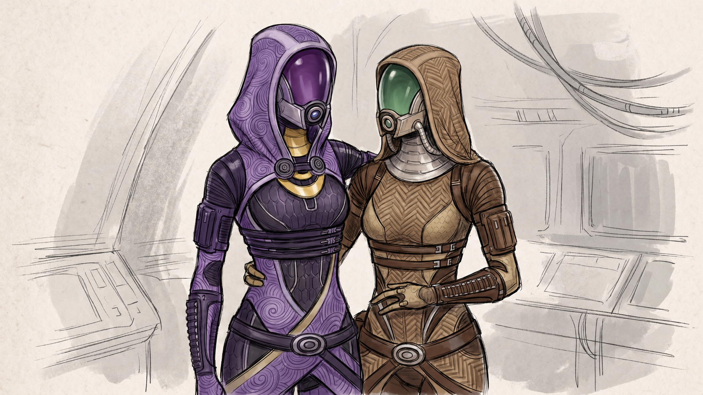

# Lia'Vael: Beyond Citadel

A narrative expansion mod for Mass Effect 2 that gives Lia'Vael a second chance beyond the Citadel.

## Project Overview

This project extends **Lia'Vael**, a minor quarian NPC on the Citadel (Zakera Ward), by:

- expanding her dialogue after her initial encounter
- providing narrative continuity beyond the original scene
- integrating her into the Normandy as a **non-squad engineer NPC**

## Core Goal

Deliver a **lore-consistent character continuation** where Lia'Vael:

- gets a second opportunity through Shepard
- joins the Normandy in a minor engineering role
- develops a small but meaningful arc alongside Tali

## Out of Scope

- romance path with Lia
- squadmate conversion for Lia
- rewrite of the main story
- mandatory interaction chains for progression

## Intended Experience

- continuity and immersion mod
- player empathy payoff
- low-impact narrative addition

## Narrative Intent

This mod exists to expand a missed opportunity in the base game and reinforce:

- discrimination
- survival
- second chances

while allowing the player to **meaningfully help Lia'Vael**.

## Key Entities

- Lia'Vael — target NPC (Citadel -> Normandy)
- Tali'Zorah — narrative anchor
- Shepard — player agency driver

## Documentation

- `AGENTS.md` — operational entry point for AI agents.
- `docs/README.md` — index of project guidance documents.
- `docs/design-principles.md` — lore and narrative design principles.
- `docs/phase-order.md` — phased implementation order.
- `docs/constraints.md` — hard constraints and guardrails.
- `docs/character-role-rules.md` — Tali/Gabby/Ken role rules.
- `docs/technical-focus-areas.md` — technical integration surfaces.
- `docs/narrative-guidelines.md` — tone and interaction examples.
